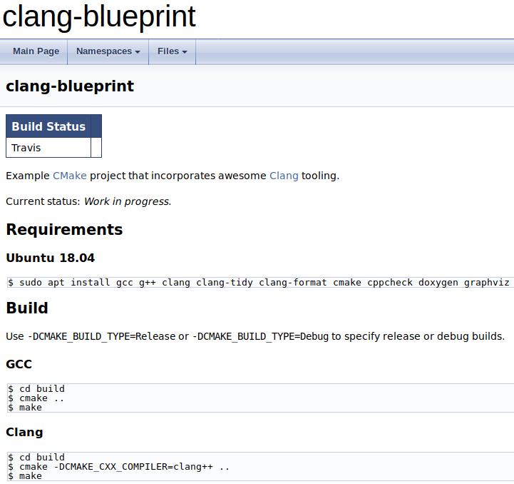
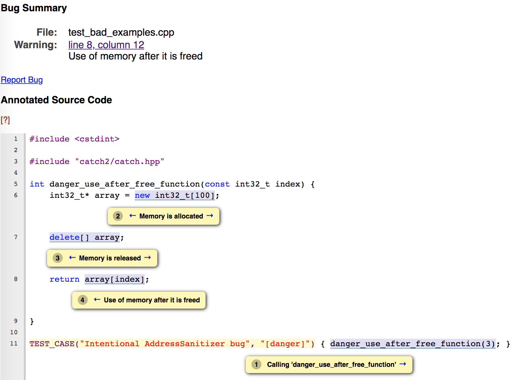
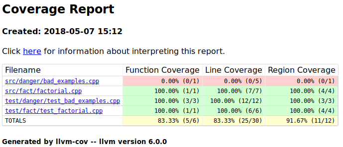

# clang-blueprint

<!-- Doxygen Table of Contents -->
[TOC]

| Build Status |                                                                                |
|--------------|--------------------------------------------------------------------------------|
| Travis       | [![Travis Build Status][travis-build-status-svg]][travis-build-status]         |

Example C++11 [CMake](https://cmake.org/)  project that incorporates awesome 
[Clang](https://clang.llvm.org/) tooling, such as sanitizers, a code formatter, and code coverage
reporting.

This repository is designed to be used as an example of how to set up a C++ project to use
Clang tooling as well as be a template that can be copied and modified. Care has been taken to 
follow established C++ conventions whenever possible. 

For more information about Clang, see the 
[awesome-clang](https://github.com/ingve/awesome-clang) repository.

For C++ coding guidelines, see the 
[C++ Core Guidelines](https://github.com/isocpp/CppCoreGuidelines).

## Requirements

### Ubuntu 18.04 LTS

Install required packages.

> On Ubuntu 16.04 LTS, omit the `clang-tools` package, which is included in the `clang` package on Ubuntu 16.04 LTS.

```bash
$ sudo apt install gcc g++ clang clang-tidy clang-tools clang-format cmake cppcheck doxygen graphviz
```

### macOS

Install [Homebrew](https://brew.sh/)

Install required packages

```
$ brew install llvm clang-format cmake cppcheck doxygen graphviz
```

The `llvm` formula is not installed into the user's `PATH` by default because it shadows
tools such as `clang` that Apple provide. In order to use `clang-tidy` and LLVM code
coverage tools, we need those in the `PATH` when `cmake` runs.

```bash
$ echo 'export PATH="/usr/local/opt/llvm/bin:$PATH"' >> ~/.bash_profile
```

### CentOS 7

First install the [EPEL](https://fedoraproject.org/wiki/EPEL) repository.

```bash
$ sudo yum install epel-release
```

Next install the [SCL](https://wiki.centos.org/AdditionalResources/Repositories/SCL) repository.

```bash
$ sudo yum install centos-release-scl
```

Install required packages

```bash
$ sudo yum install gcc gcc-c++ llvm-toolset-7 llvm-toolset-7-clang-tools-extra cmake3 cppcheck doxygen graphviz
```

## Build

Append `-DCMAKE_BUILD_TYPE=Release` or `-DCMAKE_BUILD_TYPE=Debug` to the `cmake` command
arguments to specify release or debug builds.

### GCC

```bash
$ cd build
$ cmake ..
$ make
```

### Clang

**Note: On CentOS 7, replace the `cmake` command with 
`scl enable llvm-toolset-7 'cmake3 -DCMAKE_CXX_COMPILER=clang++ ..'`.**

```bash
$ cd build
$ cmake -DCMAKE_CXX_COMPILER=clang++ ..
$ make
```

### Treat warnings as errors

Use `-DWERROR=On` option to treat compile warnings as errors.

```bash
$ cd build
$ cmake -DWERROR=On ..
$ make
/home/user/GitHub/clang-blueprint/src/danger/bad_examples.cpp:13:18: error: array index
      3 is past the end of the array (which contains 2 elements)
      [-Werror,-Warray-bounds]
    std::cout << a[3];
                 ^ ~
...
```

## Run

First, perform a build as described in the **Build** section, then run the following
commands in the `build` directory.

### Application

```bash
$ ./clang-blueprint
```

### Unit tests

Unit tests are written using the [Catch2](https://github.com/catchorg/Catch2/) unit testing
framework.

```bash
$ ./unit_test
```

## Build Docs

Documentation is built using [Doxygen](http://www.doxygen.org/). To configure how the docs are 
built, modify [`docs/Doxyfile`](docs/Doxyfile).

```bash
$ cd docs
$ doxygen
$ firefox html/index.html
```



## Clang Tools

**Note: On CentOS 7 for all of the following Clang tool instructions, replace the `cmake` 
command with `scl enable llvm-toolset-7 'cmake3 <OPTIONS> ..'`.**

### Clang Static Analyzer

The [Clang Static Analyzer](https://clang-analyzer.llvm.org/) finds bugs in C/C++ programs
at compile time.

**Note: Not available on CentOS 7.**

```bash
$ cd build
# On Ubuntu 18.04, use the specific scan-build-6.0 command.
$ scan-build cmake ..
$ scan-build make
...
scan-build: 2 bugs found.
scan-build: Run 'scan-view /var/folders/...' to examine bug reports.

# Run the scan-view command printed in the build output to view the report.
# On Ubuntu 18.04, use the specific scan-view-6.0 command.
$ scan-view /var/folders/...
```




### Clang-Tidy

[Clang-Tidy](http://clang.llvm.org/extra/clang-tidy/) is configured using the 
[`.clang-tidy`](.clang-tidy) configuration file. Modify this file to control which checks should 
be run and configure parameters for certain checks.

For real projects, you'll likely want to modify this configuration file and disable certain
checks you feel are too pedantic or don't match your project needs.

```bash
$ cd build
$ cmake ..
$ make clang-tidy
Scanning dependencies of target clang-tidy
95 warnings generated.
7477 warnings generated.
/home/user/GitHub/clang-blueprint/src/main.cpp:10:28: warning: 
    parameter 'argc' is unused [misc-unused-parameters]
int32_t main(const int32_t argc, const char* argv[]) {
                           ^~~~~
                            /*argc*/
/home/user/GitHub/clang-blueprint/src/main.
...
```

### AddressSanitizer

[AddressSanitizer](https://clang.llvm.org/docs/AddressSanitizer.html) is a fast memory error
detector. It consists of a compiler instrumentation module and a run-time library.
The tool can detect the following types of bugs:

- Out-of-bounds accesses to heap, stack and globals
- Use-after-free
- Use-after-return
- Use-after-scope
- Double-free, invalid free
- Memory leaks

It is similar in functionality to Valgrind, but runs much faster and is able to catch a
wider variety of bugs.

```bash
$ cd build
$ cmake -DCMAKE_BUILD_TYPE=Debug -DCMAKE_CXX_COMPILER=clang++ -DADDRESS_SANITIZER=On ..
$ make
$ ./unit_test
==25797==ERROR: AddressSanitizer: heap-use-after-free on address 0x61400000024c at 
pc 0x000000616ecf bp 0x7ffd7aab4b30 sp 0x7ffd7aab4b28
...
```

### UndefinedBehaviourSanitizer

The [UndefinedBehaviourSanitizer](https://clang.llvm.org/docs/UndefinedBehaviorSanitizer.html)
modifies the program at compile-time to catch various kinds of undefined behavior during 
program execution, for example:

- Using misaligned or null pointer
- Signed integer overflow
- Conversion to, from, or between floating-point types which would overflow the destination

```bash
$ cd build
$ cmake -DCMAKE_BUILD_TYPE=Debug -DCMAKE_CXX_COMPILER=clang++ -DUNDEFINED_SANITIZER=On ..
$ make
$ ./unit_test
/home/user/GitHub/clang-blueprint/test/danger/test_bad_examples.cpp:17:7: 
runtime error: signed integer overflow: 2147483647 + 1 cannot be represented in type 'int'
...
```

### Clang Code Coverage

[Clang source-based code coverage](https://clang.llvm.org/docs/SourceBasedCodeCoverage.html)
provides metrics on which lines are covered by tests.

```bash
$ cd build
$ cmake -DCMAKE_BUILD_TYPE=Debug -DCMAKE_CXX_COMPILER=clang++ -DCLANG_CODE_COVERAGE=On ..
$ make
$ ./unit_test

# On Ubuntu 18.04, use the specific llvm-profdata-6.0 command.
$ llvm-profdata merge -sparse default.profraw -o default.profdata
# On Ubuntu 18.04, use the specific llvm-cov-6.0 command.
$ llvm-cov show -format=html -o coverage ./unit_test -instr-profile=default.profdata

# View the coverage report.
$ firefox coverage/index.html
```



### Clang-Format

[Clang-Format](https://clang.llvm.org/docs/ClangFormat.html) is a tool that can automically
format your source code accordiing to a specific style guide, saving developers time. It is 
configured using the [`.clang-format`](.clang-format) configuration file. Modify this file to
control how source files should be formatted.

To demonstrate `clang-format` in action, first modify a line from [`src/main.cpp`](src/main.cpp)

```cpp
    return EXIT_SUCCESS;
```

To

```cpp
    return           EXIT_SUCCESS;
```

Next, run `clang-format` on the project.

```bash
$ cd build
$ cmake ..
$ make clang-format
```

[`src/main.cpp`](src/main.cpp) will be reformatted properly to

```cpp
    return EXIT_SUCCESS;
```

## Cppcheck

[Cppcheck](http://cppcheck.sourceforge.net/) is a static analysis tool for C/C++ code. To run 
on the project

```bash
$ cd build
$ cmake ..
$ make cppcheck
[/home/user/GitHub/clang-blueprint/src/main.cpp:14]: (error) Array 'a[2]' accessed at index 3, 
    which is out of bounds.
...
```

<!-- Badges -->
[travis-build-status]: https://travis-ci.com/johnthagen/clang-blueprint
[travis-build-status-svg]: https://travis-ci.com/johnthagen/clang-blueprint.svg?branch=master
